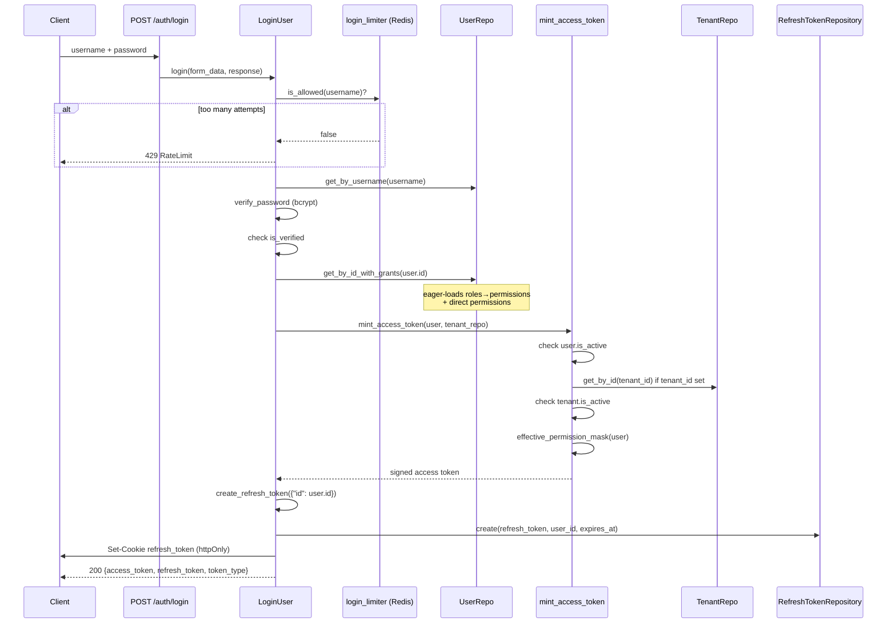
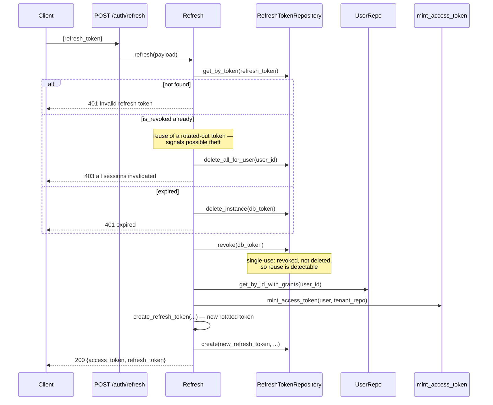

# Authentication

Dual-token JWT auth: a short-lived access token (default 30 min) used on every
request, and a long-lived, DB-tracked refresh token (default 7 days, rotated on
every use) used only to mint a new access token.

## The access token's claims

`TokenPayload` (`app/schema/auth.py`) is the typed contract for what's inside the
JWT — both encoding (`create_access_token`) and decoding (`verify_token`) go through
this one schema, in `app/services/auth/token.py`:

```python
class TokenPayload(BaseModel):
    id: uuid.UUID
    tenant_id: Optional[uuid.UUID] = None
    is_superuser: bool = False
    perm_mask: str          # hex-encoded 256-bit permission mask
    perm_version: int       # compared against the authz cache to detect staleness
    exp: datetime
    auth_method: str = "password"
```

This is deliberately more than an identity token — `perm_mask`/`perm_version`/
`tenant_id`/`is_superuser` let most requests authorize with **zero DB queries** (see
[06-authz-cache.md](./06-authz-cache.md)). The mask and version are computed once, at
mint time, by `app.services.auth.mint.mint_access_token` — see
[04-rbac-and-permissions.md](./04-rbac-and-permissions.md) for how the mask itself works.

A PyJWT/Pydantic footgun worth knowing about: PyJWT special-cases a native `datetime`
under the `"exp"` key, but its JSON encoder can't serialize `uuid.UUID`. The fix in
`create_access_token` is to `model_dump(mode="json", exclude={"exp"})` (so UUIDs
serialize) and then put the real `datetime` back for `"exp"` before calling `jwt.encode`.

## Login



`login_limiter` is a stricter, per-username throttle (5/60s) independent of the
general per-IP rate limiter that runs on every request — see
[07-rate-limiting-and-resilience.md](./07-rate-limiting-and-resilience.md).

## Refresh

The refresh token is itself a JWT (signed with a separate `REFRESH_KEY`), but its
raw string is *also* stored verbatim as the primary key of the `refreshtoken` table —
so a signature check alone is never sufficient; the DB row is the actual source of
truth for whether it's still valid.



## Logout

`LogoutUser.logout` deletes the refresh-token row by its raw string and clears the
cookie. The access token itself is *not* revoked — it simply expires on its own
schedule (up to `ACCESS_TOKEN_EXPIRE_MINUTES`).

## Registration + email verification

1. `POST /auth/register` (`RegisterUser.register`): checks username/email aren't
   taken, hashes the password (bcrypt), creates the user (`is_verified=False`), and
   fires a background task to send a verification email.
2. The email link encodes `{"email": ...}` via `itsdangerous.URLSafeTimedSerializer`
   (`create_url_safe_token`, `app/services/verify/utils.py`) — self-expiring (24h),
   no DB/Redis lookup needed since the expiry is baked into the signed token itself.
3. `GET /auth/verify/{token}` (`VerifyMail.verify_mail`) decodes it and calls
   `UserRepository.set_verified`.
4. Login is blocked (`UserNotVerified`, 403) until this step completes.

Email sending itself goes through Celery (`send_email_bg.delay(...)`, see
[09-database-and-background-jobs.md](./09-database-and-background-jobs.md)) so a slow/
down mail server never blocks the HTTP response.

## Password reset

Same self-expiring-token pattern as email verification, but with its own serializer,
its own salt (`"password-reset"` vs. `"email-configuration"`), and a much shorter
30-minute expiry — a reset link is more dangerous if it leaks (account takeover, not
just an unverified email), so it shouldn't stay valid as long.

1. `POST /auth/reset/password` (`ResetPassword.reset_password`): checks the email
   exists, fires a background task that emails a link containing
   `create_password_reset_token({"email": ...})`.
2. `POST /auth/reset/password/{token}/verify` (`PasswordReset.verify_password`):
   decodes the token (`decode_password_reset_token`, raises 400 if expired/tampered),
   checks the two password fields match, hashes and stores the new password.

## Google OAuth

`GoogleOAuthService` (`authlib`-based): `authorize_redirect` sends the user to
Google; `handle_callback` exchanges the code, looks up the user by the email Google
returns, creates one if it doesn't exist yet (auto-verified, no password, a unique
username derived from the email's local part), then mints tokens through the same
`mint_access_token` helper login/refresh use — so an OAuth-created user gets a
correctly-populated `perm_mask`/`tenant_id` claim from their very first token, not a
special-cased empty one.

## Where `get_current_user` vs. `get_current_principal` fits

Every authenticated route resolves the caller through one of two dependencies in
`app/services/auth/current_user.py` — both share a `_authenticate(token)` helper that
decodes the JWT and fails fast against the authz cache (deactivated user/tenant,
stale mask) before either does anything else:

- **`get_current_user`** — also fetches the full `User` from Postgres (with `.roles`
  eagerly loaded). Needed wherever code reads fields the JWT doesn't carry, or where
  grant-delegation logic needs real role objects. Used by `get_current_user`-based
  guards: `role_required`, `grant_role_required`, `grant_permission_required`,
  `superuser_required`.
- **`get_current_principal`** — returns a `Principal` (id/tenant_id/is_superuser/
  perm_mask/perm_version) straight from the validated JWT, no DB query at all. Used
  by `permission_required`.

See [04-rbac-and-permissions.md](./04-rbac-and-permissions.md) and
[06-authz-cache.md](./06-authz-cache.md) for why this split exists and how it stays correct.
