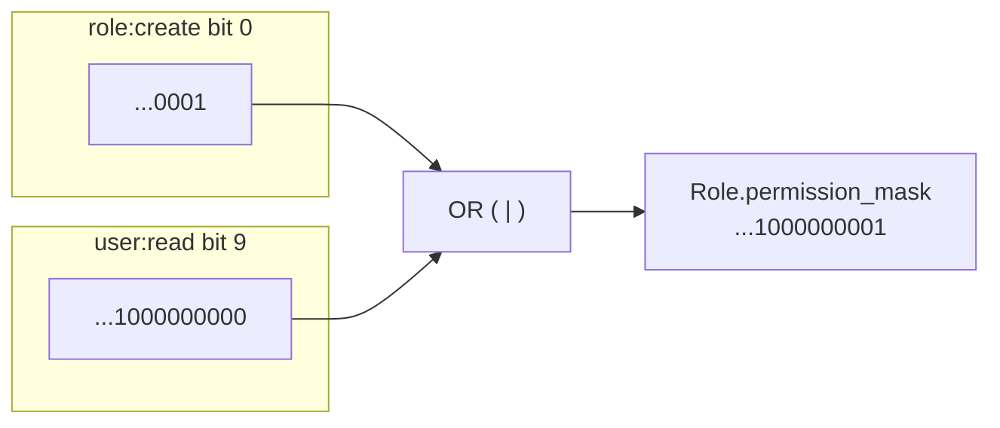
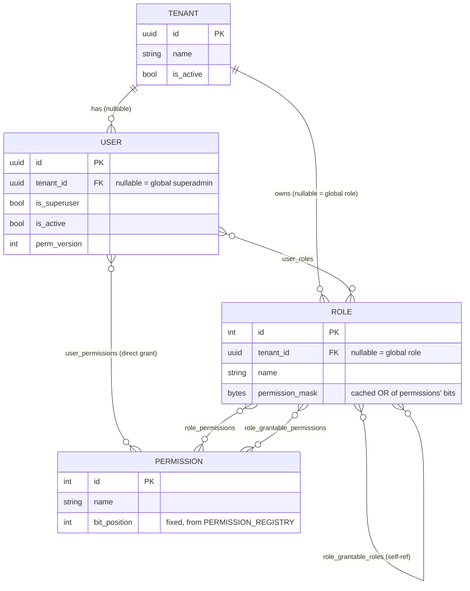

# RBAC & the Bitmask Permission System

This is the template's core feature: hierarchical, delegated RBAC where permission
checks are a single integer bit-test instead of a DB join, permission changes are
detected without polling the database, and "who can create a role with what
permissions" falls out of the same mechanism that already governs "who can assign a
role to a user."

## Why a bitmask at all

A user's permissions traditionally live as string rows joined across `roles` and
`permissions` tables — checking one permission means loading and unioning
potentially many rows, on every request. Reducing the whole permission catalog to a
fixed set of bit positions turns that into one integer, computed once and cached
(on `Role`) or embedded directly in a JWT (for a user) — checking a permission
becomes `mask & (1 << bit) != 0`, an O(1) operation with no query at all.

The tradeoff this requires: **permissions must be a fixed, known-in-advance catalog**,
not arbitrary strings created at runtime. That's why permission CRUD (`POST/PUT/DELETE
/api/v1/permission/`) doesn't exist in this template — see below.

## The permission catalog (`app/core/rbac/registry.py`)

```python
PERMISSION_REGISTRY: dict[str, int] = {
    "role:create": 0,
    "role:read": 1,
    "role:read.id": 2,
    "role:update": 3,
    "role:delete": 4,
    "role:add-permission": 5,
    "role:delete-permission": 6,
    "permission:read": 7,
    "permission:read.id": 8,
    "user:read": 9,
    "user:read.id": 10,
    "user:update": 11,
    "user:deactivate": 12,
    "tenant:create": 13,
    "tenant:read": 14,
    "tenant:read.id": 15,
    "tenant:update": 16,
    "tenant:deactivate": 17,
    # append new entries here — never edit an existing value
}
```

Rules, enforced by convention (and an `assert` at import time for duplicates/overflow):
- **Append-only.** A permission's bit position never changes and is never reused,
  even after the permission is retired.
- **256-bit ceiling** (`MASK_BYTES = 32` in `app/core/rbac/mask.py`) — generous room
  to grow; widen it if this template ever needs more than 256 distinct permissions.
- `app/cli/sync_permissions.py` mirrors this dict into the `permissions` table
  (`Permission.bit_position`) on every app startup (via `lifespan` in `main.py`) —
  idempotent, and it raises loudly if a name's DB bit position ever disagrees with
  the code, which would mean the append-only rule was violated somewhere.

This is also why `permission_required("x:y")` looks `"x:y"` up in
`PERMISSION_REGISTRY` **at route-decoration time** (import time) — a typo or a
not-yet-registered permission fails the moment the app starts, not on some later
request.

## The mask itself (`app/core/rbac/mask.py`)

A mask is a plain Python `int`, stored as 32 big-endian bytes (`BYTEA` on Postgres,
`BLOB` on SQLite) via the `PermissionMaskType` SQLAlchemy column type — not
`NUMERIC` or an integer array, because nothing here ever needs SQL-side bitwise
filtering; every mask operation happens in Python against a handful of already-fetched
rows. The same raw-bytes representation is what gets hex-encoded for the JWT's
`perm_mask` claim, so DB storage and JWT encoding share one code path
(`mask_to_hex`/`hex_to_mask`).



## Data model



Two association tables are worth calling out specifically:
- **`user_permissions`** — direct per-user grants that bypass roles entirely, for a
  permission that needs to reach exactly one person without inventing a role.
- **`role_grantable_roles`** / **`role_grantable_permissions`** — *not* what a role
  itself can do, but what a **holder** of that role is allowed to hand out to
  *other* users (or, as of this template, use when authoring a new role — see below).

## Computing effective permissions (`app/core/rbac/delegation.py`)

Two parallel functions, both requiring `user.roles`, `role.permissions`, and
`user.permissions` already eagerly loaded (`UserRepository.get_by_id_with_grants`) —
neither does any DB I/O itself:

```python
def effective_permissions(user: User) -> set[str]:
    # union of role-derived + direct permission NAMES — used where a
    # human-readable set is wanted (e.g. GET /users/me/grants)
    ...

def effective_permission_mask(user: User) -> int:
    # OR of every role's cached permission_mask, plus the bit for each
    # direct grant — this is what gets embedded in the JWT
    ...
```

## Role-name uniqueness across tenants

`Role.name` used to be globally unique. Now a role can be tenant-owned or global
(`tenant_id IS NULL`), and Postgres/SQLite treat every `NULL` as distinct under a
plain composite unique constraint — so two separate constraints are needed:

```python
__table_args__ = (
    UniqueConstraint("tenant_id", "name", name="uq_roles_tenant_id_name"),
    Index("uq_roles_global_name", "name", unique=True,
          postgresql_where=text("tenant_id IS NULL"),
          sqlite_where=text("tenant_id IS NULL")),
)
```

## The role-creation hierarchy ("admin can create admin, staff can't")

This is a **subset-mask check**, not a new mechanism — it reuses the exact
`role_grantable_permissions` table that already governs "can I assign this
permission to a user," generalized from a single-permission check to a full-mask
subset check:

```
requested_mask & ~allowed_mask != 0   →  request asks for something outside
                                          what the actor is allowed to grant
```

```mermaid
sequenceDiagram
    participant Actor as Actor (non-superuser)
    participant Route as POST /role/
    participant Service as RoleService.create_role
    participant Repo as RoleRepository

    Actor->>Route: {name, permission_names: [...]}
    Route->>Route: permission_required("role:create")<br/>(fast path — actor must already HOLD this)
    Route->>Service: create_role(role, actor)
    Service->>Service: tenant_id = actor.tenant_id (non-superuser)
    Service->>Repo: get_by_name(name, tenant_id) — duplicate check
    Service->>Service: requested_mask = mask_for(permission_names)
    Service->>Repo: get_grantable_permission_mask(actor's role ids)
    Repo-->>Service: allowed_mask
    alt requested_mask & ~allowed_mask != 0
        Service-->>Actor: 403 GrantNotAllowed
    else subset of allowed_mask
        Service->>Repo: create(role, tenant_id, permissions, permission_mask)
        Service->>Repo: add_grantable_role(actor's role → new role)
        Note over Service: auto-links so the creator can<br/>actually assign their own new role
        Service-->>Actor: 201 new Role
    end
```

Two separate things have to both be true for a non-superuser to successfully create
a role with permission X:
1. They must **hold** `role:create` themselves (the coarse route-level gate).
2. `X` must be in the set their own roles are configured to **grant** (the
   fine-grained hierarchy check above) — holding a permission and being allowed to
   hand it to someone else (or bake it into a new role) are deliberately different things.

A superuser bypasses both checks entirely, same as everywhere else in this system.

## Why `role_required` stays DB-backed while `permission_required` doesn't

Permissions are a small, fixed, code-defined catalog — that's exactly what makes a
bit position assignable. **Roles are not** — they're open-ended, tenant-authored,
and created on demand (see [05-multi-tenancy.md](./05-multi-tenancy.md)). There's no
fixed bit to give a role name, so `role_required(["admin"])` can't be moved onto the
same JWT-only fast path `permission_required` uses; it stays on `get_current_user`
(a real DB fetch, fresh every request). In practice `role_required` isn't used by any
live route today — every route uses `permission_required` or the grant-delegation
guards — but the escape hatch exists for anything that genuinely needs role-name
checks in the future.
