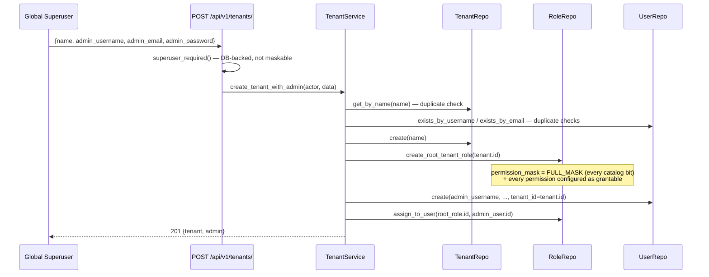

# Multi-Tenancy

Shared schema, not schema-per-tenant or DB-per-tenant: one set of tables for every
tenant, with a `tenant_id` column on the rows that need to be scoped. This is the
standard approach for the vast majority of SaaS products and the only one that stays
simple enough for a template — schema/DB-per-tenant needs dynamic connection
routing and per-tenant migrations, and is usually overkill until you already know
you need that level of isolation.

## Model

`app/models/tenant.py`:

```python
class Tenant(Base):
    __tablename__ = "tenants"
    id: uuid.UUID          # PK
    name: str               # unique
    is_active: bool         # deactivation kill-switch, see 06-authz-cache.md
```

`User.tenant_id` and `Role.tenant_id` are both **nullable foreign keys** to `tenants.id`:
- `NULL` on `User` = a global superuser, not tied to any tenant.
- `NULL` on `Role` = a global/system role available to every tenant (e.g. a seed role).

`Permission` rows are **not** tenant-scoped — they're the fixed, global catalog (see
[04-rbac-and-permissions.md](./04-rbac-and-permissions.md)); only role *authorship* and
*membership* are tenant-scoped.

## Bootstrapping a tenant

A tenant and its first admin user are created in a single call, always by the global
superuser (`superuser_required()` — not gateable by any catalog permission, since a
tenant boundary is a bigger blast radius than any `role:*`/`user:*` permission should
reach):



The tenant's first admin holds a `tenant-admin` role with **every** catalog
permission and every catalog permission configured as **grantable** — so from their
very first login, they can create further roles/users scoped to their own tenant
without the global superuser being involved again. (This is a multi-step,
non-transactional sequence like other multi-step flows in this codebase — a failure
partway through, e.g. a duplicate admin username slipping past the earlier check,
can leave an orphaned `Tenant` row with no admin. Acceptable for a template; worth a
DB transaction wrapper if this matters for a real deployment.)

## Scoping everything else to a tenant

Once a tenant exists, its admin (or anyone they delegate to) operates entirely
within that scope:

- **Creating a role**: `RoleService.create_role` sets `tenant_id = actor.tenant_id`
  for any non-superuser actor, and the subset-mask hierarchy check bounds what
  permissions they can put on it — see [04](./04-rbac-and-permissions.md).
- **Mutating an existing role**: `RoleService._ensure_role_in_scope` blocks a
  non-superuser from touching a role outside their own tenant (or a global one),
  used by `update_role`, `delete_role`, `add_permission_to_role`,
  `remove_permission_from_role`, and every grant-delegation-config method. It raises
  `RoleNotFound` rather than a 403 — deliberately, so an out-of-scope role's mere
  existence isn't confirmed to an unauthorized actor.
- **Listing users**: `UserRepository.list_by_tenant`/`count_by_tenant` exist
  alongside the superuser-only `list_all`/`count_all`.
- **Usernames/emails stay globally unique**, not tenant-scoped — two tenants both
  wanting a user named `"admin"` isn't supported today; that would need a composite
  uniqueness change touching registration/login lookups everywhere.

## Deactivating a tenant

`POST /api/v1/tenants/{id}/deactivate` (superuser-only) flips `Tenant.is_active` and
publishes a `tenant_status` event — every user under that tenant is blocked
immediately at the authz-cache layer (`app.core.authz_cache`), not just once their
current access token happens to expire. See
[06-authz-cache.md](./06-authz-cache.md) for the mechanism, and
`POST /api/v1/tenants/{id}/activate` to reverse it.

A user can also be individually deactivated (`POST /users/{id}/deactivate`,
`permission_required("user:deactivate")`) independent of their tenant — e.g. an
offboarded employee, without touching the tenant itself.
