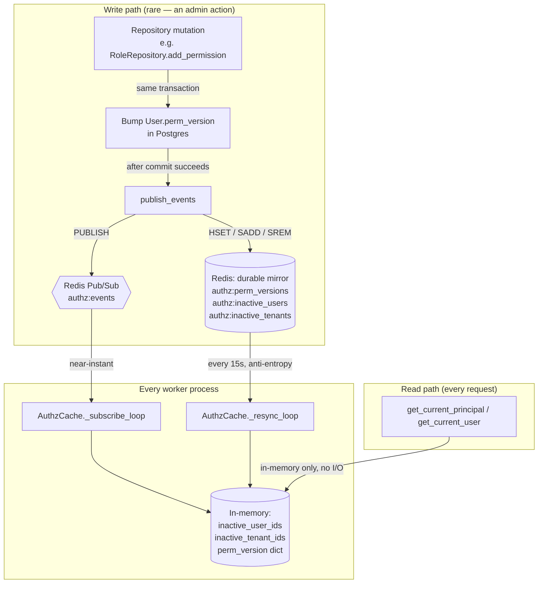
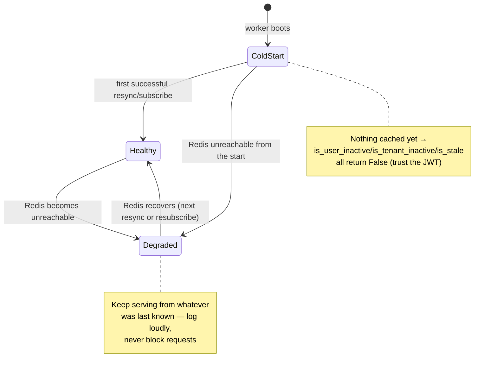
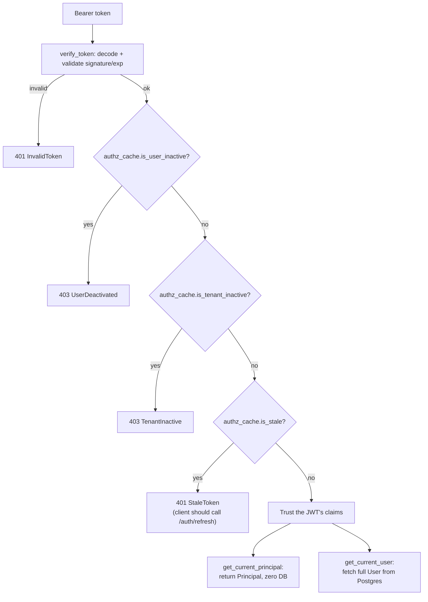

# The Authz Cache — Zero-Query Authorization at Request Time

This is the piece that makes the bitmask system ([04](./04-rbac-and-permissions.md))
actually pay off. Embedding a permission mask in a JWT is only safe if there's a way
to detect that the mask has gone stale (a permission was revoked, a user was
deactivated) — and the whole point of the mask was to *avoid* a DB round trip per
request. Checking a remote store (even Redis) on every single request would just
move the cost, not remove it.

The answer: **never query anything on the request path.** Each worker process keeps
a small in-memory cache, kept current by Redis Pub/Sub, with a periodic resync as a
safety net for missed messages. The request path becomes a plain dict/set lookup —
no network hop at all, faster than even a single Redis round trip.

This mirrors real-world precedent at very different scales: AWS IAM's data plane is
explicitly *eventually consistent* (policy changes take a few seconds to propagate
globally) rather than paying a lookup cost on every authorization decision, and
Google Zanzibar caches authorization decisions at coarse timestamps for the same
reason. A few seconds (here: up to 15) of staleness in exchange for zero request-time
I/O is the same tradeoff, at template scale.

## Architecture



## The write side (`app/core/authz_cache/publisher.py`)

`publish_events(events)` is called by repositories immediately **after** a commit
succeeds — never before, since publishing a version bump that then rolls back would
announce a change that never happened. One Redis pipeline per mutation (one round
trip regardless of how many users are affected — e.g. a role permission change fans
out to every current holder of that role):

| Mutation | Repository call | Event published |
|---|---|---|
| Role's permission set changes | `RoleRepository.add_permission`/`remove_permission` | `perm_version` bumped for **every current holder** of that role |
| Role assigned/removed from a user | `RoleRepository.assign_to_user`/`remove_from_user` | `perm_version` bumped for that one user |
| Direct permission grant/revoke | `UserRepository.grant_permission`/`revoke_permission` | `perm_version` bumped for that one user |
| User activated/deactivated | `UserRepository.set_active` | `user_status` event (no version bump — a different mechanism, see below) |
| Tenant activated/deactivated | `TenantRepository.set_active` | `tenant_status` event |

```python
{"type": "perm_version", "user_id": "...", "version": 7}
{"type": "user_status",  "user_id": "...", "is_active": false}
{"type": "tenant_status","tenant_id": "...", "is_active": false}
```

## The read side (`app/core/authz_cache/cache.py`)

`AuthzCache` is a per-worker singleton (`authz_cache`, started/stopped from
`main.py`'s `lifespan`) holding three plain in-memory structures:

```python
inactive_user_ids: set[uuid.UUID]
inactive_tenant_ids: set[uuid.UUID]
perm_version: dict[uuid.UUID, int]
```

Two background `asyncio` tasks keep them current:
- **`_subscribe_loop`** — subscribes to the `authz:events` channel, applies each
  message to the in-memory structures as it arrives. Near-instant in the common case.
- **`_resync_loop`** — every 15 seconds, does a full `HGETALL`/`SMEMBERS` against
  the Redis mirror and **replaces** all three structures wholesale. This is the
  fallback for a message the subscriber missed (Pub/Sub is fire-and-forget, not
  persisted — a worker that briefly disconnects loses whatever was published during
  that gap unless the resync catches it up).

Three read methods, all pure in-memory lookups:

```python
is_user_inactive(user_id) -> bool
is_tenant_inactive(tenant_id) -> bool          # None is never "inactive"
is_stale(user_id, token_perm_version) -> bool  # token_version < current known version
```

## Fail-open, deliberately

Every I/O path in this module is wrapped in try/except that logs and moves on —
never raises, never blocks a request:



This matches the existing convention in `app.core.ratelimit.sliding_window` — an
infrastructure outage degrades *freshness* (a revoked permission might stay valid a
little longer than intended), never *availability* (the API never goes down because
Redis did). If a deployment needs the opposite tradeoff (fail closed), that's a
deliberate change to `AuthzCache`/`get_current_principal`, not something to route
around per-endpoint.

## How a request actually uses this

`_authenticate(token)` in `app/services/auth/current_user.py` is the single choke
point both `get_current_user` and `get_current_principal` share:



`permission_required` uses the fast path exclusively — everything it needs
(`is_superuser`, `perm_mask`) is already on the `Principal`. `role_required`,
`grant_role_required`, `grant_permission_required`, and `superuser_required` all use
`get_current_user` instead, since they need the real `User.roles` or always-fresh
`is_superuser` for logic that can't be reduced to a mask bit-test (see
[04-rbac-and-permissions.md](./04-rbac-and-permissions.md) for why roles can't take the
fast path the way permissions can).

## The consequence worth internalizing: tokens don't retroactively update

A privilege change (role assignment, permission grant/revoke, superuser promotion)
never rewrites an already-issued token — it only makes the cache aware that the
token is now stale. The **client** is responsible for calling `/auth/refresh` (or
logging in again) once it sees a `stale_token`/401. This is intentional, not a rough
edge: it's the same UX every token-based system has (a config/policy change doesn't
retroactively rewrite bearer tokens already in the wild), and it's exactly why
`/auth/refresh` re-mints the mask/version fresh from the DB every time it's called.

See the `write-tests` skill's "stale-token gotcha" section for what this means
concretely when writing a test that grants a permission and then immediately expects
the same token to reflect it.
