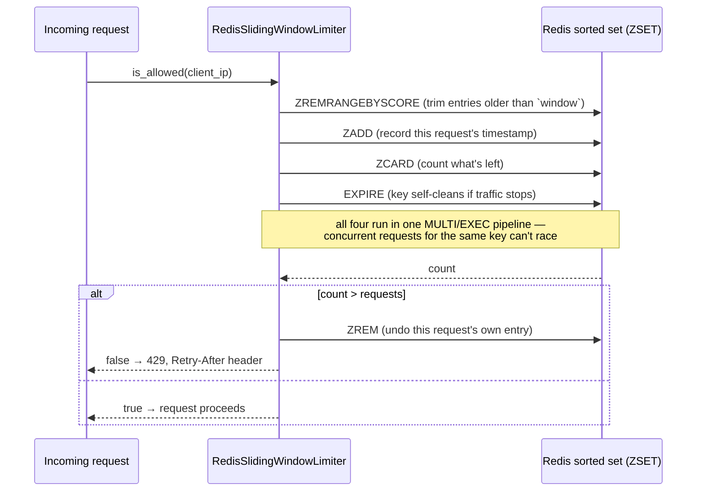
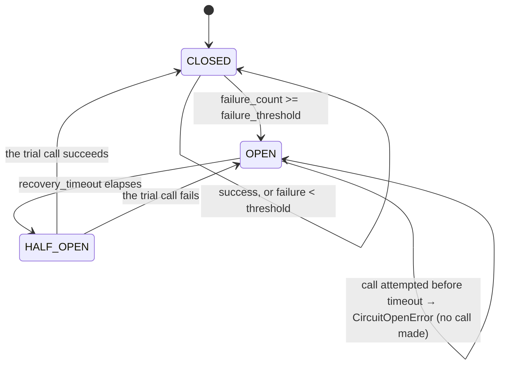

# Rate Limiting & Resilience

## Rate limiting — Redis sliding-window log

`app/core/ratelimit/sliding_window.py`'s `RedisSlidingWindowLimiter` backs two
shared instances in `app/core/ratelimit/limiters.py`:

- **`limiter`** — 10 requests / 60s per client IP, applied to every request via
  `app/middleware/ratelimiting_middleware.py`.
- **`login_limiter`** — 5 requests / 60s per *username* (not IP), applied only
  inside `LoginUser.login` — brute-force resistance that doesn't care which IP the
  attempts come from.

### Why sliding-window-log, not a fixed counter

A fixed window (`INCR` a counter, reset every 60s) lets up to ~2x the limit through
if requests cluster around the boundary (e.g. 10 requests at 0:59, 10 more at 1:01).
A sliding-window log records every request's *timestamp* as a member of a Redis
sorted set and, on each check, trims anything older than the window before counting
what's left — so the limit always applies to a true trailing window.



A fresh `redis.asyncio.Redis` client is constructed **per call**, not cached —
clients bind their connection pool to whatever event loop was active when first
used, and a cached client breaks under pytest-asyncio's per-test loops (or any
multi-loop scenario). Construction itself does no I/O, so this is essentially free.

### Fail open

If Redis is unreachable, `is_allowed`/`get_remaining` catch the exception, log a
warning, and return `True`/the full limit — the API stays up; only the rate-limit
guarantee itself is temporarily lost. This is the same convention the authz cache
(`app.core.authz_cache`) follows — see
[06-authz-cache.md](./06-authz-cache.md).

## Resilience toolkit (`app/core/resilience/recovery.py`)

Two independent tools for calling flaky external services — nothing in this
template currently needs them (there's no external service integration yet beyond
Postgres/Redis/mail/Google, which have their own handling), but they're the pattern
to reach for when one is added.

### Retry with exponential backoff + jitter

```python
async def async_retry(func, *args, config: RetryConfig | None = None, **kwargs) -> T
```

Retries on `ConnectionError`, `TimeoutError`, `asyncio.TimeoutError`, `OSError` (not
arbitrary exceptions — a genuine business-logic error shouldn't be retried). Delay
grows as `base_delay * backoff_factor ** attempt`, capped at `max_delay`, randomized
within `[0, delay]` when `jitter=True` (spreads out retries from many callers instead
of them all retrying in lockstep). A `@retry(config=...)` decorator wraps the same
logic around a whole function.

### Circuit breaker



`CircuitBreaker(name, config)` must be a **module-level singleton** per external
service — instantiating a fresh one per call defeats the entire point, since it
would never accumulate failures across calls and never trip. Usage:

```python
payment_breaker = CircuitBreaker("payment-gateway")  # module-level, once
result = await payment_breaker.call(payment_service.charge, amount=100)
```

`CircuitOpenError` (raised when the circuit is `OPEN`) is registered in
`app/error/register.py` and mapped to `429 Too Many Requests` — the same status code
as an ordinary rate limit, since both mean "back off and retry later" to a client.
