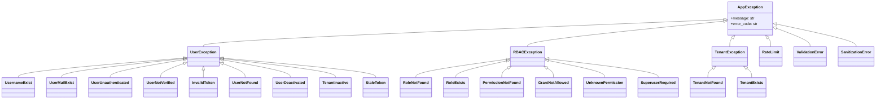
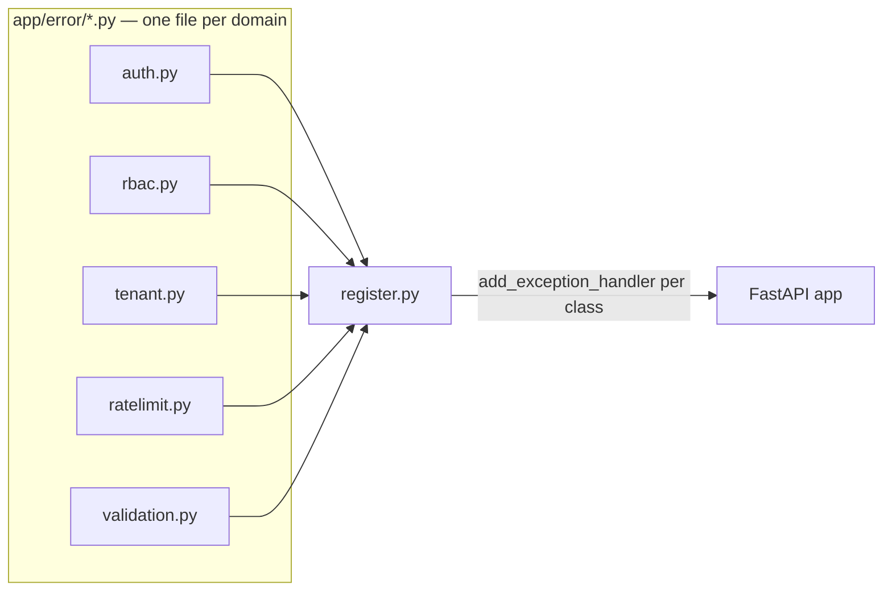
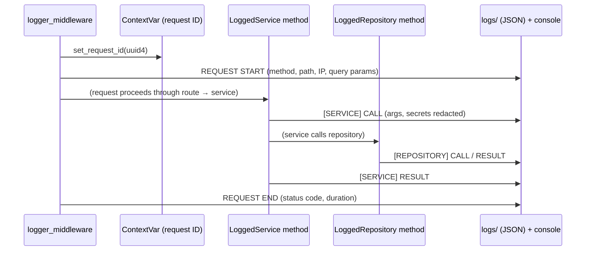

# Error Handling & Logging

## Exception hierarchy

Every custom exception extends `AppException` (`app/error/base.py`), split into one
file per domain — never a grab-bag:

Note `TenantInactive`/`UserDeactivated`/`StaleToken` live under `error/auth.py`
(`UserException`), not `error/tenant.py` — they're *auth-flow* failures (something
about resolving the caller went wrong), not tenant-CRUD failures.

## Registration (`app/error/register.py`)

The one file that imports every exception above and wires each to an HTTP status via
`app.add_exception_handler`:

Adding a new exception: (1) add the class to the domain file it belongs to, (2)
register its handler here with the right status code, (3) raise it from a service —
never a route, never a repository.

## The rule at each layer

- **Repository**: never catches exceptions — lets them bubble to the service.
- **Service**: the only layer that raises `AppException` subclasses. Never returns
  `None`/an error dict/a raw `HTTPException` for an expected failure.
- **Route**: never has a `try/except` — the global handler (registered for the base
  `Exception` class, mapped to 500) catches anything unhandled.

Every response from a registered handler has the same shape: `{"message": ...,
"error_code": ...}` — `error_code` is what clients/tests should branch on (e.g.
`"stale_token"` telling a frontend to silently call `/auth/refresh` instead of
forcing a re-login), not the HTTP status alone.

## Structured logging (`app/core/logger/`)

Split by concern, not domain, since logging isn't domain-shaped:

| File | Responsibility |
|---|---|
| `context.py` | A `ContextVar` holding the current request ID, set once per request by the logging middleware, readable from anywhere in that request's call stack (including background tasks spawned from it) |
| `formatters.py` | JSON formatter (for the `logs/` directory) + a human-readable console formatter |
| `setup.py` | Constructs the logger and its handlers |
| `emit.py` | The actual structured log-record emitters (`log_request_start`, `log_request_end`, `log_error`, plus the `[SERVICE]`/`[REPOSITORY]`/`[ROUTE]` call/result logs) and `_redact_value` — replaces known-sensitive field values (password/token/secret/key) before they ever reach a log line |
| `decorators.py` | `@log_function` (wraps a route handler), `LoggedService`/`LoggedRepository` (base classes that auto-log every public method call + result) |

Every log line inside one request — across route, service, and repository calls,
and any background task the request spawned — carries the same request ID, so
`grep`ing `logs/` for one ID reconstructs the full call chain for that request.

Inheriting from `LoggedService`/`LoggedRepository` is what makes the `[SERVICE]`/
`[REPOSITORY]` call/result logging automatic — new services/repositories should
extend these rather than logging manually.
