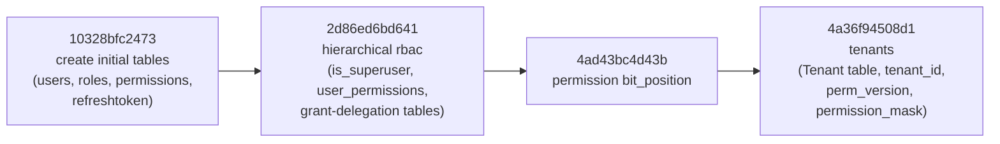
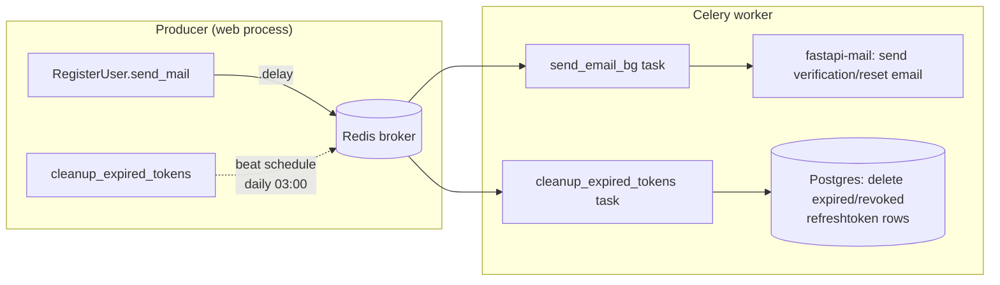

# Database, Migrations & Background Jobs

## Connections (`app/database/`)

| File | Provides |
|---|---|
| `postgres_db.py` | `Base` (the SQLAlchemy declarative base every model inherits from), `engine` (async engine), `get_db()` — the FastAPI dependency every repository is constructed with |
| `redis_db.py` | `redis_connect()` — builds a fresh `redis.asyncio.Redis` client with short connect/socket timeouts (1s) and retries disabled. Used by the rate limiter, the authz cache, and health checks |

`get_db()` yields one `AsyncSession` per request; in tests it's overridden
(`tests/conftest.py`) to point at an in-memory SQLite database instead.

### Why a fresh Redis client per call, not a cached one

`redis.asyncio` clients bind their connection pool to whichever event loop was
running when they were first constructed. A cached client breaks the moment it's
reused under a different loop — which happens constantly under `pytest-asyncio`'s
per-test event loops, and can happen in production too. Constructing the client does
no I/O by itself, so building one per call costs nothing extra.

## Migrations (Alembic)



`migrations/env.py` imports `Base`/every model from `app.models.db_model` — the
single surface Alembic (and everything else) uses — and reads the connection URL
from `app.settings.Config.DB_URL`.

```bash
alembic revision --autogenerate -m "description"   # after changing a model
alembic upgrade head                                # apply pending migrations
```

Tests never run these migrations — `tests/conftest.py` builds the schema directly
from the current models (`Base.metadata.create_all`) against an in-memory SQLite
database, so a schema change is exercised through the models immediately without
needing a migration to exist yet.

## Background jobs (Celery, `app/queue/`)



`app/queue/celery.py` configures the Celery app:
- Redis as both broker and result backend URL — but **`task_ignore_result=True`**,
  since nothing in this app ever calls `.get()` on a task result. Without this,
  every `.delay()` call sets up a result-tracking Pub/Sub subscription that retries
  internally and can hang for a long time if Redis is unreachable — independent of
  any socket-level timeout.
- Explicit broker connect/socket timeouts (3s) so a totally unreachable Redis fails
  the `.delay()` call fast instead of blocking the request thread that made it.
- A beat schedule: `cleanup_expired_tokens` runs daily at 03:00, deleting
  `refreshtoken` rows that are expired or already revoked — otherwise that table
  grows forever.

`app/queue/task.py` defines the two tasks:
- **`send_email_bg`** — fire-and-forget email sending (verification links, password
  reset links, generic notifications). Runs the async `mail.send_message` call via
  `asyncio.run` inside the (sync) Celery task.
- **`cleanup_expired_tokens`** — the periodic housekeeping task above.

Run a worker + beat scheduler locally:

```bash
python -m celery -A app.queue.celery worker --loglevel=info
python -m celery -A app.queue.celery beat --loglevel=info
```

In tests, both `mail_config.mail.send_message` and `send_email_bg.delay` are
monkeypatched to no-ops (`tests/conftest.py`'s `_no_real_mail` fixture) — without
this, any test touching registration or password reset would depend on a real
Redis broker and mail server being reachable.
