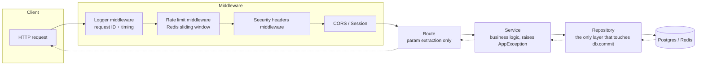
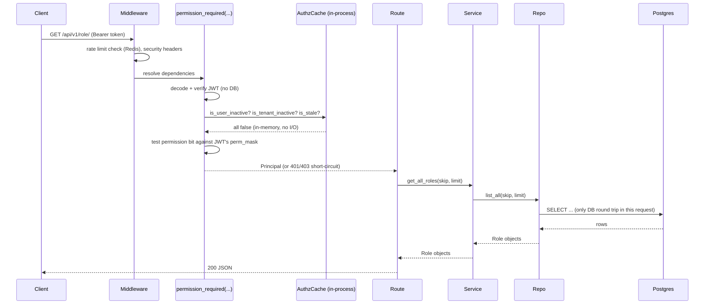

# FastAPI Template — Documentation

This folder documents how this codebase actually works: every file's role, and a
deep dive into each core feature with diagrams. Start here, then follow the links
below for the area you care about.

## Contents

| Doc | Covers |
|---|---|
| [02-project-layout.md](./02-project-layout.md) | Every `.py` file under `app/` and `migrations/`, one to two lines each, organized by layer |
| [03-authentication.md](./03-authentication.md) | Register/login/refresh/logout, Google OAuth, JWT claims, password reset, email verification |
| [04-rbac-and-permissions.md](./04-rbac-and-permissions.md) | The fixed permission catalog, the 256-bit mask, roles, grant delegation, role-creation hierarchy |
| [05-multi-tenancy.md](./05-multi-tenancy.md) | Tenants, tenant-scoped roles/users, the superuser → tenant-admin bootstrap flow |
| [06-authz-cache.md](./06-authz-cache.md) | The in-process cache that makes most requests authorize with zero DB queries |
| [07-rate-limiting-and-resilience.md](./07-rate-limiting-and-resilience.md) | Sliding-window rate limiting, retry with backoff, circuit breaker |
| [08-error-handling-and-logging.md](./08-error-handling-and-logging.md) | Exception hierarchy, global handlers, structured request logging |
| [09-database-and-background-jobs.md](./09-database-and-background-jobs.md) | Postgres/Redis connections, Alembic migrations, Celery tasks |

## What this template is

A production-oriented FastAPI backend: JWT auth with refresh-token rotation,
hierarchical/delegated RBAC with a bitmask permission system, multi-tenancy, Redis-backed
rate limiting, structured logging, and a resilience toolkit (retry + circuit breaker) —
all wired through one consistent layered architecture.

## Tech stack

| Concern | Library |
|---|---|
| Web framework | FastAPI (async) |
| ORM | SQLAlchemy 2.x (async), asyncpg driver |
| Migrations | Alembic |
| Cache / broker / rate-limit store | Redis (`redis.asyncio`) |
| Background jobs | Celery (broker + periodic beat schedule) |
| Auth tokens | PyJWT (access tokens), `itsdangerous` (email-verification / password-reset links) |
| Password hashing | `bcrypt` |
| Email | `fastapi-mail` |
| Validation | Pydantic v2 |
| Testing | `pytest` + `pytest-asyncio`, in-memory SQLite, `httpx.AsyncClient` |

## Layered architecture

Every request flows through the same five layers, in the same order, with no
layer allowed to skip ahead:

- **Route**: extracts path/query/body params, calls one service method, returns its result. No business logic, no DB session.
- **Service**: the only layer allowed to raise `AppException` subclasses; orchestrates one or more repositories. Extends `LoggedService` for automatic call/result logging.
- **Repository**: the only layer allowed to call `db.commit()`. Extends `LoggedRepository`.
- Dependency injection for all of the above is centralized in `app/core/dependency_factory/`, split by domain — see [02-project-layout.md](./02-project-layout.md).

## The big picture: request → response for an authenticated, permission-gated endpoint

The permission check itself costs zero DB/network I/O — see
[06-authz-cache.md](./06-authz-cache.md) for why that's possible and what keeps it correct.
